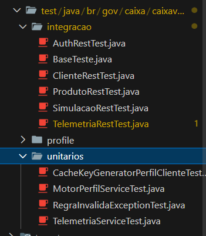
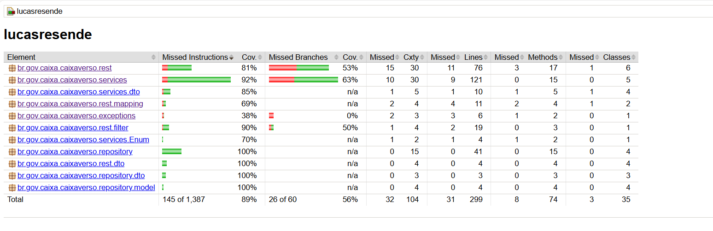
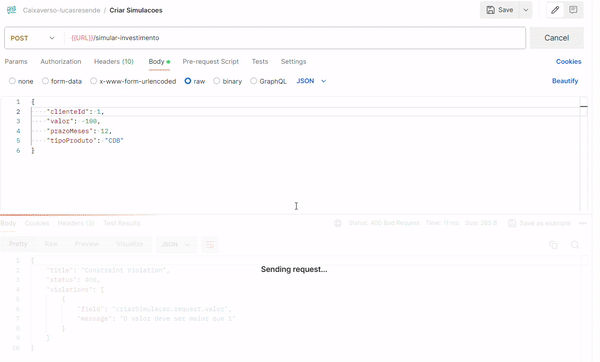
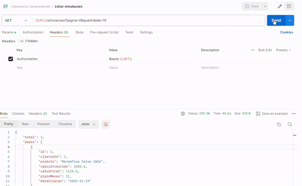
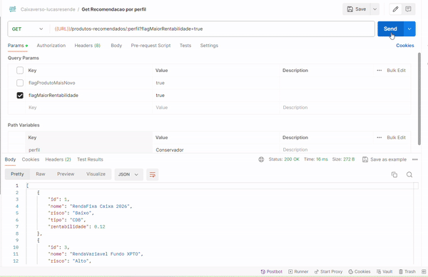

# Desafio CaixaVerso Lucas Resende de Sousa Amaral

Olá, obrigado por está analisando a minha implementação do desafio do CaixaVerso. As tecnologias usadas para implementar foram:
* Quarkus
* Java 21
* Qute
* Mssql e H2
* Mockito e JUnit
* Docker e Docker-compose
* AWS

# 📝 Get Start

Você pode seguir este readme para analisar o que foi entregue nesse projeto, porém recomendo que fique até final, onde temos um bônus, além de ter feito a API do desáfio, também de forma a inovar decidi criar um front end onde chama a API desenvolvida para melhor exemplificar as suas funcionalidades.

O deploy dessa aplicação foi feito na AWS, pode ser localizado nesse link: [http://ec2-98-84-174-176.compute-1.amazonaws.com/documentacao](http://ec2-98-84-174-176.compute-1.amazonaws.com/documentacao)

# 🧪 Teste unitário e de Integração

A API está com uma cobertura de testes acima de 80% com testes unitário e de integração.




# 🐋 Configurando o ambiente

Para configurar o ambiente, siga os passos abaixo:

1. Certifique-se de ter o Docker e Docker Compose instalados em sua máquina.
2. Clone o repositorio localmente: 
```bash
git clone git@github.com:lucasres/caixa-verso-lucasresende.git
```
3. Entre na pasta do projeto e configure suas variaveis de ambiente:

```bash
vi .env
```

| Variável         | Descrição                          | Exemplo               |
|------------------|------------------------------------|-----------------------|
| `DB_URL`         | Endereço do banco de dados         | `localhost`           |
| `DB_KIND`        | Especifica o tipo do banco         | `mssql ou h2`         |
| `DB_USER`        | Usuário do banco de dados          | `sa`                  |
| `DB_PASSWORD`    | Senha do banco de dados            | `sua_senha`           |


4. Execute o comando abaixo para iniciar os serviços definidos no arquivo `docker-compose.yml`:
```bash
docker-compose up
```

3. Após a execução, você verá os serviços sendo inicializados.

### Exemplo de execução:


# 🔒 Autenticação

A API foi criada com autenticação JWT usando a lib `quarkus-smallrye-jwt`, além da autenticação padrão por JWT, também foi implementado um RBAC(Role Based Access Control), onde usuário podem ter diferentes perfils para poder acessar rotas com privilégios exigidos.

**Requisição de login**:

```
POST http://ec2-98-84-174-176.compute-1.amazonaws.com/v1/auth
body:
{
    "cpf": "12345678912",
    "password": "12345678"
}
```

**Retorno do login**:

```
{
    "jwt": "..."
}
```

**Requisição de cadastro**:

```
POST http://ec2-98-84-174-176.compute-1.amazonaws.com/v1/auth/cadastro
body:
{
    "cpf": "12345678915",
    "password": "12345678",
    "nome": "Lucas Resende"
}
```

**Retorno do cadastro**:

```
{
    "jwt": "..."
}
```

### Exemplo de execução


Podemos ver um exmeplo do playload decodificado:

```json
{
  ...
  "upn": "12345678915",
  "clienteId": 2,
  "groups": [
    "User",
    "Admin"
  ],
  "iat": 1763568588,
  "exp": 1763568888,
  "jti": "38267a4d-3ceb-404f-83a7-f032271c6fe0"
}
```

# 💰 Criar simulações

Para criar uma simulação faça a seguinte request:

```
POST http://ec2-98-84-174-176.compute-1.amazonaws.com/simular-investimento
headers:
{
    "Authorization": Bearer {{JWT}}
}
body:
{
    "clienteId": 1,
    "valor": 1000,
    "prazoMeses": 4,
    "tipoProduto": "CDB"
}
```

**Retorno da simulação**, A api também calculará a rentabilidade esperada para cada mês do investimeto:

```json
{
    "produtoValidado": {
        "id": 1,
        "nome": "RendaFixa Caixa 2026",
        "risco": "Baixo",
        "tipo": "CDB",
        "rentabilidade": 0.12
    },
    "dataSimulacao": "2025-11-19T13:45:48Z",
    "resultadoSimulacao": {
        "rentabilidadeEfetiva": 0.12,
        "progressao": [
            1009.49,
            1019.07,
            1028.74,
            1038.5
        ],
        "valorFinal": 1038.5,
        "prazoMeses": 5
    }
}
```

### Exemplo de execução



# 💰 Listar simulações

A API de listagem de simulações é paginada, então o usuário poderá informar qual página e quantidade de dados quer que seja retornado na consulta.

```
POST http://ec2-98-84-174-176.compute-1.amazonaws.com/simulacoes?pagina=0&quantidade=10
headers:
{
    "Authorization": Bearer {{JWT}}
}
```

**Retorno da listagem**:

```json
{
    "total": 3,
    "dados": [
        {
            "id": 1,
            "clienteId": 1,
            "produto": "RendaFixa Caixa 2026",
            "valorInvestido": 1000.0,
            "valorFinal": 1120.0,
            "prazoMeses": 12,
            "dataCriacao": "2025-11-19"
        },
        ...
    ]
}
```

### Exemplo de execução




# 🗓️ Listar SImulações por produto por dia

A API de listagem de simulações por dia, agrupará os dados por dia, trazendo a quantidade de produtos naquele dia para aquele tipo de produto

```
POST http://ec2-98-84-174-176.compute-1.amazonaws.com/simulacoes/por-produto-dia
headers:
{
    "Authorization": Bearer {{JWT}}
}
```

**Retorno da listagem**:

```json
[
    {
        "nome": "RendaFixa Caixa 2026",
        "quantidadeSimulacoes": 3,
        "data": "2025-11-19",
        "mediaValorFinal": 1092.83
    },
    {
        "nome": "RendaVariavel Fundo XPTO",
        "quantidadeSimulacoes": 1,
        "data": "2025-11-19",
        "mediaValorFinal": 1068.53
    }
]
```

### Exemplo de execução


# 👨‍💼 Perfil do cliente

O cálculo da pontuação do perfil do cliente leva em consideração o histórico de investimento que ele realizou. O calcul consistem em uma média ponderada, onde temos 3 tipos de pesos: **risco**, **freqencia** e **valor investido**.

Para a frequência e valor investido, existem 3 faixas que vão receber o valor propocional dentro de sua faixa. 

O valor de cada peso e suas faixas, pode, ser configurado alterando as variáveis de ambientes, e estão disponíveis na tabela a baixo:

| Nome        | Descrição                                            | Intervalo  |  Peso(Valor padrão) |
|-------------|------------------------------------------------------|------------|---------------------|
| Risco       | Média do risco de todos investimentos * 33           | 0 - 99     |  7                  |
|             | Baixo = 1                                            |            |                     |
|             | Médio = 2                                            |            |                     |
|             | Alto  = 3                                            |            |                     |
| Valor       | Somatório de todas os investimento                   |            |  2                  |
|             | Faixa 1 - 0 até R$ 10.000                            | 0 - 33     |                     |
|             | Faixa 2 - R$ 10.000 até R$ 100.000                   | 33 - 66    |                     |
|             | Faixa 3 - Acima de R$ 100.001                        | 100        |                     |
| Frequência  | Quanto maior a frequência maior o valor              |            |  1                  |
|             | Faixa 1 - 0 até 3                                    | 0 - 33     |                     |
|             | Faixa 2 - 3 até 6                                    | 0 - 66     |                     |
|             | Faixa 3 - Acima de 6                                 | 100        |                     |
| Total       |                                                      |            |  10                 |

Exemplo de um cáculo:

Um cliente que tem 3 investimento de risco Alto, cada um com 10.000 investido, vai ter o seguinte cálculo de pontuação:
```
Média de risco: (3 + 3 + 3 / 3) => 3
Frequência: 3
Valor: 10.000 + 10.000 + 10.000 => 30.000

Aplicando os intervalos
Intervalor peso: 3 * 33 = 99
Intervalor frequência - Faixa 1: (3/3) * 33 => 33 
Intervalor valor investido - Faixa 2: (30.000/100.000 * 33) + 33 (Faixa anterior) => 43

Aplicando os pesos:
((99 * 7) + (33 * 1) + (43 * 2))/10 => 81

```

Após ser calculado a pontuação o cliente é enquadrado em uma das seguintes faixas:

| Nome        | Descrição                                            |
|-------------|------------------------------------------------------|
| Conservador | Até 45                                               |
| Moderado    | Até 66                                               |
| Agressivo   | Acima de 66                                          |

```
POST http://ec2-98-84-174-176.compute-1.amazonaws.com/perfil-risco/{clienteId}
headers:
{
    "Authorization": Bearer {{JWT}}
}
```

**Retorno do perfil**:

```json
{
    "clienteId": 1,
    "perfil": "Agressivo",
    "pontuacao": 81,
    "descricao": "Busca por alta rentabilidade, maior risco"
}
```

### Exemplo de execução


Se quiser pode configurar novos pesos e novas faixas de pontuação, criando as seguintes variaveis de ambientes:

| Variável             | Descrição                          | Exemplo               |
|----------------------|------------------------------------|-----------------------|
| `PESO_RISCO`         | Valor do peso do risco             | `3` padrão(7)         |
| `PESO_FREQ`          | Valor do peso da frequência        | `2` padrão(2)         |
| `FAIXA_CONSERVADOR`  | Limite da faixa de conservador     | `33` padrão(45)       |
| `FAIXA_MODERADO`     | Limite da faixa de moderado        | `66` padrão(66)       |


# 👨‍💼 Recomendação de produto

O motor de recomendações, utiliza o mesmo cálculo de perfil, ele recupera o identificador do cliente e calcula o seu perfil, e procuta por um produto segundo o perfil passado.

Exemplo:
```
Cliente com perfil: Conservado
Pede uma recomendação de perfil: Moderado
Produtos retornados:
Risco Baixo + Risco Médio
```

```
POST http://ec2-98-84-174-176.compute-1.amazonaws.com/produtos-recomendados/{perfil}
headers:
{
    "Authorization": Bearer {{JWT}}
}
```

**Retorno das recomendações**:

```json
[
    {
        "id": 1,
        "nome": "RendaFixa Caixa 2026",
        "risco": "Baixo",
        "tipo": "CDB",
        "rentabilidade": 0.12
    },
    {
        "id": 2,
        "nome": "Debenture Empresa XPTO",
        "risco": "Medio",
        "tipo": "Debenture",
        "rentabilidade": 0.18
    }
]
```

### Exemplo de execução

