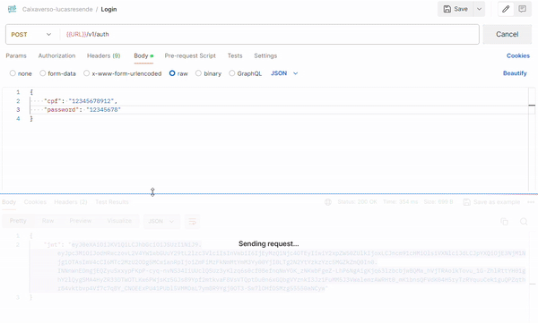

# Desafio CaixaVerso Lucas Resende de Sousa Amaral

Olá, obrigado por está analisando a minha implementação do desafio do CaixaVerso. As tecnologias usadas para implementar foram:
* Quarkus
* Java 21
* Qute
* Mssql e H2
* Mockito e JUnit
* Docker e Docker-compose
* AWS

# 📝 Get Start

Você pode seguir este readme para analisar o que foi entregue nesse projeto, porém recomendo que fique até final, onde temos um bônus, além de ter feito a API do desáfio, também de forma a inovar decidi criar um front end onde chama a API desenvolvida para melhor exemplificar as suas funcionalidades.

O deploy dessa aplicação foi feito na AWS, pode ser localizado nesse link: [http://ec2-98-84-174-176.compute-1.amazonaws.com/documentacao](http://ec2-98-84-174-176.compute-1.amazonaws.com/documentacao)

# 🐋 Configurando o ambiente

Para configurar o ambiente, siga os passos abaixo:

1. Certifique-se de ter o Docker e Docker Compose instalados em sua máquina.
2. Clone o repositorio localmente: 
```bash
git clone git@github.com:lucasres/caixa-verso-lucasresende.git
```
3. Entre na pasta do projeto e configure suas variaveis de ambiente:

```bash
vi .env
```

| Variável         | Descrição                          | Exemplo               |
|------------------|------------------------------------|-----------------------|
| `DB_URL`         | Endereço do banco de dados         | `localhost`           |
| `DB_KIND`        | Especifica o tipo do banco         | `mssql ou h2`         |
| `DB_USER`        | Usuário do banco de dados          | `sa`                  |
| `DB_PASSWORD`    | Senha do banco de dados            | `sua_senha`           |


4. Execute o comando abaixo para iniciar os serviços definidos no arquivo `docker-compose.yml`:
```bash
docker-compose up
```

3. Após a execução, você verá os serviços sendo inicializados.

### Exemplo de execução:


# 🔒 Autenticação

A API foi criada com autenticação JWT usando a lib `quarkus-smallrye-jwt`, além da autenticação padrão por JWT, também foi implementado um RBAC(Role Based Access Control), onde usuário podem ter diferentes perfils para poder acessar rotas com privilégios exigidos.

**Requisição de login**:

```
POST http://ec2-98-84-174-176.compute-1.amazonaws.com/v1/auth
body:
{
    "cpf": "12345678912",
    "password": "12345678"
}
```

**Retorno do login**:

```
{
    "jwt": "..."
}
```

**Requisição de cadastro**:

```
POST http://ec2-98-84-174-176.compute-1.amazonaws.com/v1/auth/cadastro
body:
{
    "cpf": "12345678915",
    "password": "12345678",
    "nome": "Lucas Resende"
}
```

**Retorno do cadastro**:

```
{
    "jwt": "..."
}
```

### Exemplo de execução




Podemos ver um exmeplo do playload decodificado:

```json
{
  ...
  "upn": "12345678915",
  "clienteId": 2,
  "groups": [
    "User",
    "Admin"
  ],
  "iat": 1763568588,
  "exp": 1763568888,
  "jti": "38267a4d-3ceb-404f-83a7-f032271c6fe0"
}
```